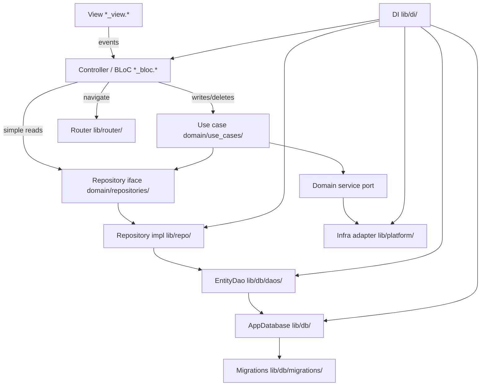

# Architecture — bedrockLauncher

bedrockLauncher is an Android custom home screen app launcher built as a layered
Flutter app — the domain stays pure and every outer layer depends inward.

## Layers

Order layers from innermost (most pure, fewest dependencies) to outermost.

| Layer | Directory | Responsibility | May depend on |
|-------|-----------|----------------|---------------|
| Domain | `lib/domain/` | Entities, models, repository interfaces, service ports, use cases (grouped by entity/function under `use_cases/`), formatters, validators. Pure — no framework. | (nothing internal) |
| Data-access | `lib/repo/` | Repository implementations that fulfil domain interfaces. | Domain, DB |
| Persistence | `lib/db/` | Connection (`AppDatabase`), table DDL, migrations, DAOs — one DAO per table/aggregate. | Domain |
| Infra adapters | `lib/platform/` | Android/OS/plugin adapters implementing domain service ports. | Domain |
| Presentation | `lib/screens/` | Views + state/controllers (BLoCs). Views render; controllers hold logic. | Domain, router, di, theme |
| Cross-cutting | `lib/router/`, `lib/di/`, `lib/theme/`, `lib/logger/` | Routing, dependency injection, design tokens, logging. | Domain + presentation as needed |

## Core rules

1. **BLoC** performs writes/deletes through a **use case** and simple reads
   through a **repository**.
2. **All navigation happens in BLoCs** — never in views or shared widgets.
   Every screen must be registered with a route in `lib/router/`. Views only
   dispatch events (e.g. `backTapped`); the BLoC navigates by calling
   `AppRouter` with that registered route. Views must not import the router or
   `go_router`.
3. **No infrastructure / plugins in BLoC or views** — infrastructure is reached
   only through domain ports implemented in `lib/platform/` / `lib/repo/`.
4. **The domain is pure** — it must not import any outer layer or framework.
5. **API HTTP calls** (when remote APIs exist) are made from `lib/repo/` or
   `lib/platform/` (not from controllers/views). Completion logging is
   centralized in the shared HTTP client — see AGENTS.md for format
   (`Success …` / `Failed …`; `logger.i` / `logger.w`). Temporary diagnostic
   logs: `logger.d` only — remove before finishing.

## Stack

- **State:** `flutter_bloc`
- **Routing:** `go_router` via `AppRouter` in `lib/router/`
- **DI:** `get_it` in `lib/di/`
- **Logging:** `logger` in `lib/logger/`
- **Persistence:** `sqflite` via `lib/db/`
- **Installed apps:** vendored `device_apps` (`packages/device_apps`) via
  `lib/platform/` adapters

## Logger setup

Centralize the `logger` package in `lib/logger/logger.*`. Configure
`PrettyPrinter` with a short stack trace from the log call site:

```dart
import 'package:logger/logger.dart';

final logger = Logger(
  printer: PrettyPrinter(
    methodCount: 1,
    errorMethodCount: 1,
    lineLength: 120,
  ),
);
```

## Strict import table

This is the authoritative deny-list. For each file group, list the import
prefixes it must **not** contain. The lint-rules class and architecture test
encode exactly this table.

- **`lib/domain/**`** must not import: `package:flutter/`,
  `package:bedrock_launcher/screens/`, `package:bedrock_launcher/repo/`,
  `package:bedrock_launcher/db/`, `package:bedrock_launcher/platform/`,
  `package:bedrock_launcher/router/`, `package:bedrock_launcher/di/`,
  `package:bedrock_launcher/theme/`, `package:flutter_bloc/`, `package:go_router/`.
- **`lib/repo/**`** must not import: `package:flutter/`,
  `package:bedrock_launcher/screens/`, `package:bedrock_launcher/router/`,
  `package:bedrock_launcher/di/`, `package:flutter_bloc/`.
- **`lib/db/**`** must not import: `package:flutter/`,
  `package:bedrock_launcher/screens/`, `package:bedrock_launcher/repo/`,
  `package:bedrock_launcher/router/`, `package:bedrock_launcher/di/`,
  `package:flutter_bloc/`.
- **`lib/platform/**`** must not import: `package:bedrock_launcher/screens/`,
  `package:bedrock_launcher/repo/`, `package:bedrock_launcher/db/`,
  `package:bedrock_launcher/router/`, `package:bedrock_launcher/di/`,
  `package:flutter_bloc/`.
- **Views (`*_view.*`)** must not import: `package:bedrock_launcher/repo/`,
  `package:bedrock_launcher/db/`, `package:bedrock_launcher/router/`,
  `package:bedrock_launcher/di/`, `package:go_router/`.
- **Controllers (`*_bloc.*` / `*_event.*` / `*_state.*`)** must not import:
  `package:bedrock_launcher/repo/`, `package:bedrock_launcher/db/`,
  `package:go_router/`, `sqflite`, Android intent / package-manager wrappers,
  `url_launcher` (expand as platform deps are added).
- **Shared components** must not import: `package:bedrock_launcher/repo/`,
  `package:bedrock_launcher/db/`, `package:bedrock_launcher/router/`,
  `package:bedrock_launcher/di/`, `package:flutter_bloc/`, `package:go_router/`.

## Data flow



Domain interfaces (`Repo`, `Port`, `UseCase`) live in the domain layer;
`RepoImpl` and `Platform` implement them from outer layers and are wired in
`lib/di/`. Repository impls call **DAOs** (not raw `Database`); DAOs return
domain entities directly.

**Installed apps:** Ephemeral platform reads go through
`InstalledAppsRepository` → `InstalledAppsRepositoryImpl` → `InstalledAppsPort`
→ `AndroidInstalledAppsAdapter` (`device_apps` plugin). The repository keeps an
in-memory cache (warmed at startup in `main.dart`) so Home and All Apps share
one PackageManager scan. `UninstallAppUseCase` invalidates the cache after
uninstall.

## Remote DTOs

When remote APIs exist, JSON DTOs (`json_serializable`) belong in the repo/HTTP
path. Map to domain entities before crossing into controllers. DAOs continue to
own SQL and return domain entities — see
`docs/agent-guidelines/03-serialization.md`.

### Persistence layout (`lib/db/`)

```
lib/db/
├── app_database.*          # connection, version, transaction()
├── tables/                 # CREATE TABLE DDL / table constants
├── migrations/             # incremental upgrade steps
└── daos/<entity>_dao.*     # one DAO per table — SQL CRUD
```

- **`AppDatabase`** — open/close, `onCreate`/`onUpgrade`, `transaction()` for
  cross-DAO writes. No per-table queries.
- **`<Entity>Dao`** — table-specific SELECT/INSERT/UPDATE/DELETE; maps query
  results to domain entities.
- **Repository impls** — the only callers of DAOs; may combine local DAO data
  with remote HTTP responses when remote APIs exist.

### Read path (example)

1. BLoC calls `FavoriteAppRepository.getAll()` (domain interface).
2. `FavoriteAppRepositoryImpl` calls `FavoriteAppDao.findAll()` → domain
   `FavoriteApp`.
3. BLoC receives domain type only.

### Write path (example)

1. BLoC dispatches to `AddFavoriteAppUseCase`.
2. Use case calls `FavoriteAppRepository.save(favorite)`.
3. `FavoriteAppRepositoryImpl` calls `FavoriteAppDao.upsert(favorite)`.
4. Cross-table write: `AppDatabase.transaction((db) async { ... })` with DAOs
   receiving the transactional `db` handle.

### Example snippets

`app_database.*` — connection shell only:

```dart
class AppDatabase {
  static const _version = 4;
  Database? _db;

  Future<Database> get database async => _db ??= await _open();

  Future<T> transaction<T>(Future<T> Function(Database db) action) async {
    final db = await database;
    return db.transaction((txn) => action(txn));
  }
}
```

`daos/favorite_app_dao.*` — per-table CRUD:

```dart
class FavoriteAppDao {
  FavoriteAppDao(this._appDb);
  final AppDatabase _appDb;

  Future<List<FavoriteApp>> findAll({Database? db}) async { ... }
  Future<void> upsert(FavoriteApp favorite, {Database? db}) async { ... }
}
```

`repo/favorite_app_repository_impl.*` — orchestrates DAO:

```dart
class FavoriteAppRepositoryImpl implements FavoriteAppRepository {
  FavoriteAppRepositoryImpl(this._favoriteAppDao);
  final FavoriteAppDao _favoriteAppDao;

  @override
  Future<List<FavoriteApp>> getAll() async {
    return _favoriteAppDao.findAll();
  }
}
```

`di/di.*` — split registration into private helpers (`_registerSingletons`,
`_registerUseCases`, `_registerScreens`, …), group entries with section
comments (e.g. `// favorite use cases`), and call those helpers from one public
startup method run from `main` before `runApp`. Inside `_registerSingletons`,
order is AppDatabase → DAOs → repository impls / platform adapters:

```dart
Future<void> configureDependencies() async {
  _registerSingletons();
  _registerUseCases();
  _registerScreens();
}

void _registerSingletons() {
  // database
  getIt.registerLazySingleton<AppDatabase>(() => AppDatabase());
  getIt.registerLazySingleton<FavoriteAppDao>(() => FavoriteAppDao(getIt()));

  // favorite repos
  getIt.registerLazySingleton<FavoriteAppRepository>(
    () => FavoriteAppRepositoryImpl(getIt()),
  );
}

void _registerUseCases() {
  // favorite use cases
  getIt.registerLazySingleton(() => AddFavoriteAppUseCase(getIt()));
}

void _registerScreens() {
  // home screens
  getIt.registerFactory(() => HomeBloc(getIt()));
}
```

## Changing a boundary

A boundary change is a three-file change, all in the same commit:

1. Update the **Strict import table** above.
2. Update the deny-lists in `bedrock_launcher_lint_rules` (see
   [enforcement.md](enforcement.md)).
3. Update / re-run `test/architecture/layer_import_test.dart`.

If they disagree, the table wins and the other two are bugs.

## Design language

The app uses **two visual systems** — a minimal home launcher and a Windows 95–styled
settings experience. They must not share chrome.

| Document | Scope |
|----------|-------|
| [design-language.md](design-language.md) | Master doc: principles, route → theme mapping, token namespaces |
| [home-design-spec.md](home-design-spec.md) | Home: app-name list, background layer, lower-half browser swipe, corner slots |
| [settings-design-spec.md](settings-design-spec.md) | Settings: Win95 palette, beveled controls, window frames |
| [all-apps-design-spec.md](all-apps-design-spec.md) | All Apps drawer |

Token namespaces live under `lib/theme/launcher/` and `lib/theme/win95/`, with
shared scaffolding in `lib/theme/app_colors.dart`, `app_spacing.dart`, and
`app_theme.dart`. Route → theme mapping is defined in
[design-language.md](design-language.md).

## Current status

Layered folders under `lib/` (`domain/`, `repo/`, `db/`, `platform/`,
`screens/`, `router/`, `di/`, `theme/`, `logger/`) and enforcement artifacts
(`bedrock_launcher_lint_rules/`, `test/architecture/layer_import_test.dart`) are
in place. Cross-cutting wiring (DI, router, theme, logger) is wired.

Home, All Apps, and Settings screens (including appearance, permissions, and
favorites sub-screens) are implemented with BLoCs, domain ports/adapters in
`lib/platform/`, and installed-apps flow via `InstalledAppsRepository` /
`AndroidInstalledAppsAdapter`. Device fonts for launcher labels use
`InstalledFontsPort` / `AndroidInstalledFontsAdapter` + `SystemFontsHandler`.
Favorites and appearance preferences persist via
SQLite (`lib/db/` tables, migrations, DAOs), repository impls, and write use
cases. Android launcher registration (HOME intent, `QUERY_ALL_PACKAGES`) is
configured per [`android-launcher-guide.md`](android-launcher-guide.md). The home
background is rendered in Flutter via `LauncherBackground`; the Android activity
uses the standard opaque `LaunchTheme` / `NormalTheme`.
