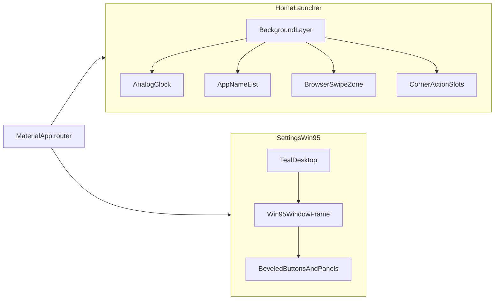

# Design language — bedrockLauncher

bedrockLauncher uses **two distinct visual systems**. The contrast is intentional:
a modern, minimal home launcher and a nostalgic Windows 95 settings experience.

> **Audience:** Coding agents and contributors. Feature-level specs live in
> [`home-design-spec.md`](home-design-spec.md) and
> [`settings-design-spec.md`](settings-design-spec.md). Follow `AGENTS.md` and
> [`architecture.md`](architecture.md) before writing code.

---

## Document map

| § | Section |
|---|---------|
| 1 | [Overview](#1-overview) |
| 2 | [Design principles](#2-design-principles) |
| 3 | [Route → theme mapping](#3-route--theme-mapping) |
| 4 | [Token namespaces](#4-token-namespaces) |
| 5 | [Future code layout](#5-future-code-layout) |
| 6 | [Shared rules](#6-shared-rules) |

---

## 1. Overview

| Surface | Aesthetic | Purpose |
|---------|-----------|---------|
| **Home launcher** | Clean, minimal, content-first | Centered analog clock with battery ring in the upper third; scrollable app-name list over a configurable background; lower-half swipe-up opens the default browser (taps pass through); corner slots reserved for future actions |
| **Settings** | Windows 95 retro | Classic gray palette, 3D beveled controls, window-style panels on a teal desktop |

Home and settings **must not share chrome**. Do not reuse Win95 buttons on the
launcher surface or Material 3 components inside settings windows.



---

## 2. Design principles

### Home launcher

- **Typography-led** — v1 shows app names only; no icons, grid, or folders.
- **Flutter-owned background** — full-bleed `LauncherBackground` layer; user
  theme color from appearance preferences (no system wallpaper passthrough).
- **High contrast** — configurable text color (black or white) over the user
  theme background; rows stay readable over arbitrary backgrounds.
- **No Material 3 chrome** — no app bar, FAB, or Material buttons on the home
  surface.
- **Extensible corners** — four fixed corner slots for future features (settings,
  search, widgets, etc.) without changing the core list layout.
- **Hidden browser shortcut** — swipe up on the lower half opens the system default
  browser; the overlay is invisible and must not block taps on app names (list
  scroll gestures in the zone do not need to pass through).

### Settings (Windows 95)

- **Faithful affordances** — outset/inset 3D borders, title bars, system gray
  (`#C0C0C0`), navy active title bars (`#000080`).
- **Touch-friendly on mobile** — scale controls for ~48 dp minimum touch targets
  without abandoning the retro look ( thicker borders, taller title bars ).
- **Window metaphor** — each settings screen is a centered window on a teal
  desktop backdrop; navigation pushes new windows or replaces content inside the
  frame.
- **Isolated theme** — Win95 tokens and widgets apply only under `/settings/**`.

---

## 3. Route → theme mapping

| Route group | Theme namespace | Applied via |
|-------------|-----------------|-------------|
| `/` (home) | `launcher` | Local `Theme` override or dedicated launcher tokens in home views |
| `/settings/**` | `win95` | `Theme` wrapper on the settings route subtree |

The root `MaterialApp` theme ([`lib/theme/app_theme.dart`](../lib/theme/app_theme.dart))
remains a neutral scaffold. Feature views override locally until dedicated
`LauncherTheme` / `Win95Theme` helpers exist.

---

## 4. Token namespaces

All colors, spacing, typography, and border widths must come from named tokens.
Views must not hardcode hex values.

### Launcher (`launcher*`)

Defined in detail in [`home-design-spec.md`](home-design-spec.md) §6.

| Token | Value | Usage |
|-------|-------|-------|
| `launcherBackgroundFallback` | `#1A1A1A` | Default background before prefs load |
| `launcherAppName` | `#1A1A1A` | App name text |
| `launcherAppNamePressed` | 70% opacity of `launcherAppName` | Pressed / highlight state |
| `launcherListPaddingHorizontal` | `AppSpacing.md` (16) | List horizontal inset |
| `launcherListItemPaddingVertical` | `AppSpacing.md` (16) | Vertical padding inside each row |
| `launcherListSeparator` | same as `launcherAppName` | 1 dp rule between names |
| `launcherCornerSlotSize` | 48 dp | Minimum corner touch target |
| `launcherAppNameSize` | 18–20 sp | App name typography |
| `launcherBrowserSwipeZoneFraction` | `0.5` | Lower-half browser swipe overlay height |
| `launcherBrowserSwipeMinDistance` | 48 dp | Minimum upward swipe distance |

### Win95 (`win95*`)

Defined in detail in [`settings-design-spec.md`](settings-design-spec.md) §6.

| Token | Hex | Usage |
|-------|-----|-------|
| `win95Desktop` | `#008080` | Settings screen backdrop |
| `win95WindowFace` | `#C0C0C0` | Window / panel background |
| `win95ButtonFace` | `#C0C0C0` | Raised button fill |
| `win95Highlight` | `#FFFFFF` | Top / left bevel (light) |
| `win95Shadow` | `#808080` | Bottom / right bevel (mid) |
| `win95DarkShadow` | `#000000` | Outer 1 px edge |
| `win95TitleBarActive` | `#000080` | Active title bar |
| `win95TitleBarInactive` | `#808080` | Inactive title bar |
| `win95TitleBarText` | `#FFFFFF` | Title bar labels |
| `win95Text` | `#000000` | Body text |
| `win95Selection` | `#000080` | Selected list item background |
| `win95SelectionText` | `#FFFFFF` | Selected list item text |

Shared spacing continues to use [`AppSpacing`](../lib/theme/app_spacing.dart)
where no domain-specific token exists.

---

## 5. Future code layout

Documented for implementation; **not created yet** in the documentation-only pass.

```
lib/theme/
  launcher/
    launcher_colors.dart
    launcher_typography.dart
    launcher_theme.dart
  win95/
    win95_colors.dart
    win95_typography.dart
    win95_decorations.dart      # bevel borders, pressed/outset helpers
    win95_theme.dart
  app_theme.dart                # neutral MaterialApp default

lib/screens/components/
  launcher/
    launcher_background.dart
    launcher_app_list.dart
    corner_action_slot.dart
    browser_swipe_zone.dart
  win95/
    win95_button.dart
    win95_panel.dart
    win95_window_frame.dart
    win95_title_bar.dart
```

Existing files under [`lib/theme/`](../lib/theme/) (`app_colors.dart`,
`app_spacing.dart`, `app_theme.dart`) are a **placeholder** Material 3 scaffold.
Replace or extend them per this document when implementation begins.

---

## 6. Shared rules

1. **Tokens only** — reference `launcher*` / `win95*` names in views and specs;
   never inline hex in presentation code.
2. **Navigation in BLoC** — views dispatch events; controllers call
   `AppRouter` / `go_router`. See `AGENTS.md`.
3. **No cross-contamination** — launcher components live under
   `screens/components/launcher/`; Win95 components under
   `screens/components/win95/`. Do not import Win95 widgets from home views.
4. **Background in Flutter** — the home background is rendered by
   `LauncherBackground` using the user's theme color from appearance preferences.
   Do not use Android transparent-window or system-wallpaper passthrough.
5. **Keep docs in sync** — when tokens or boundaries change, update this file,
   the affected feature spec, and [`architecture.md`](architecture.md) in the
   same change.

---

## Related documents

| Document | Scope |
|----------|-------|
| [`home-design-spec.md`](home-design-spec.md) | Home launcher layout, list, corner slots |
| [`settings-design-spec.md`](settings-design-spec.md) | Win95 controls, windows, settings routes |
| [`architecture.md`](architecture.md) | Layer boundaries and project status |
| [`design-spec.template.md`](design-spec.template.md) | Template for new feature specs |
